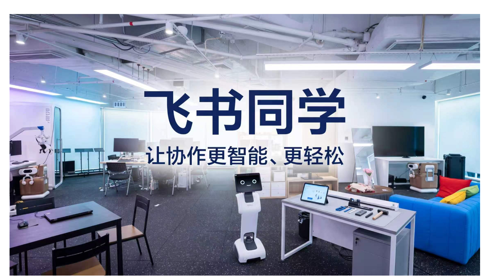
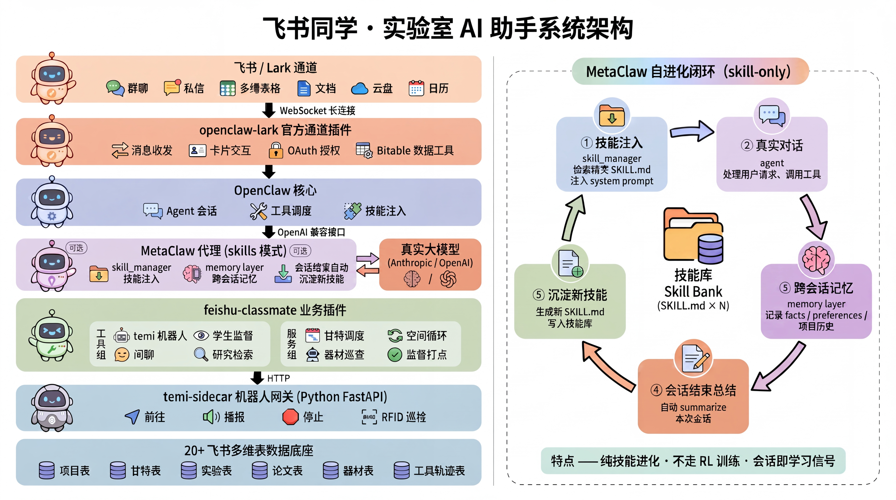

<div align="center">

# 飞书同学 · Feishu Classmate



<br/>


### 实验室办公场景下的**智能伙伴** · Lab Assistant for the Robotics Lab

**OpenClaw**(大脑) + **Temi**(身体) + **飞书**(记忆) + **MetaClaw**(技能注入)

[✨ Features](#-features) · [🚀 Quick Start](#-quick-start) · [🛠️ Skills](#️-skills-catalog) · [🏗️ Architecture](#️-architecture) · [📊 Data](#-data-model)

</div>

---

## 🔭 Overview

**飞书同学** 是给机器人实验室量身定制的 AI 实验伙伴,驻扎在飞书里,每天帮你:

- 🎓 **带访客参观** 实验室,自动生成个性化讲解稿 + Temi 现场走位/播报/问答
- 📋 **管理项目进度**,项目录入、甘特图自动更新、逾期智能检查、帮扶提醒
- 🔬 **自主研究**,每周读 Lab 知识库 → 自主选题 → 联网检索 → 研究报告
- 🤝 **科研协作**,预研课题发现、研究计划拆解、学术社交;重型验证交接 [AutoResearchClaw](#-autoresearchclaw-集成验证实验性-idea)
- 📚 **论文检索**,多平台学术文献检索,按同学偏好记忆
- 🤖 **控制 Temi**,自然语言指令驱动机器人

> 8 个 Agentic Skill,与 `skills/` 目录一一对应。


> 赛道:开放创新赛道。

---

## ✨ Features

| 类别 | 功能 | Skill |
|---|---|---|
| 👋 **访客导览** | 知识库母版 + 访客背景联网搜索 → 个性化讲解稿;Temi 现场走位/播报/工位补充/问答 | `conduct-lab-tour` · `lab-tour-prepare` · `lab-tour-run` |
| 📊 **项目管理** | 项目信息录入、甘特图自动更新、逾期智能检查、高优先级高颗粒跟踪、智能帮扶提醒 | `manage-project` |
| 🔬 **自主研究** | 每周自动读 Lab 知识库 → 自主选题 → 联网检索前沿 → 生成研究报告 | `autonomous-research` |
| 🤝 **科研协作** | 预研课题发现、研究计划与任务拆解、甘特时间线推进、学术社交 | `research-collaboration-agent` |
| 🧪 **idea 验证** | 实验性 idea → [AutoResearchClaw](#-autoresearchclaw-集成验证实验性-idea) 23-stage 流水线(真实文献 + sandbox 实验 + 多 agent 审稿)→ 论文草稿作为验证产物 | `research-collaboration-agent` → `arc-sidecar` |
| 📚 **论文检索** | 多平台学术文献检索,按同学 `open_id` 记忆论文偏好 | `academic-paper-search` |
| 🤖 **Temi 控制** | 自然语言指令 → Temi SDK / sidecar | `temi-connector` |

---

## 🏗️ Architecture



完整六层链路:**飞书/Lark 通道** → **openclaw-lark 官方通道插件** → **OpenClaw 核心** → **MetaClaw 代理(skills 模式,可选)** → **feishu-classmate 业务插件** → **temi-sidecar 网关 + Temi 机器人**,底座是 20+ 飞书多维表。

右侧是 **MetaClaw 自进化闭环(skill-only)**:技能注入 → 真实对话 → 跨会话记忆 → 会话结束总结 → 沉淀新 SKILL.md 写回技能库 → 闭环。纯技能进化,**不走 RL 训练**,会话本身就是学习信号。

---

## 🚀 Quick Start

### 1. 环境要求

| 依赖 | 版本 | 说明 |
|---|---|---|
| Node.js | 22+ | OpenClaw 要求 |
| Python | 3.10+ | Temi sidecar |
| pnpm | 10+ | 包管理 |
| OpenClaw | ≥ 2026.4.10 | `npm i -g openclaw` |
| MetaClaw | 可选 | `pip install aiming-metaclaw`(skills 模式) |
| 飞书自建应用 | — | 权限清单见 [docs/DEPLOYMENT.md](docs/DEPLOYMENT.md) |

### 2. 安装 + 启动

```bash
# 克隆 + 装依赖
git clone https://github.com/BaiTianHaoNian/feishu-classmate.git
cd feishu-classmate
pnpm install

# 配飞书应用(在 open.feishu.cn 创建,需要 bitable:app / base:app:create / docx:document / im:* 等)
cp .env.example .env
# 编辑 .env,填 FEISHU_APP_ID / FEISHU_APP_SECRET / LLM_API_KEY

# 配 OpenClaw 本地 gateway + 飞书通道
node_modules/.bin/openclaw config set gateway.mode local
node_modules/.bin/openclaw config set channels.feishu.appId "$FEISHU_APP_ID"
node_modules/.bin/openclaw config set channels.feishu.appSecret "$FEISHU_APP_SECRET"
node_modules/.bin/openclaw config set channels.feishu.domain feishu
node_modules/.bin/openclaw config set channels.feishu.dmPolicy open
node_modules/.bin/openclaw config set channels.feishu.groupPolicy open

# 装插件(本地链接模式)
pnpm build
node_modules/.bin/openclaw plugins install --link --dangerously-force-unsafe-install .
node_modules/.bin/openclaw plugins install --link --dangerously-force-unsafe-install node_modules/@larksuite/openclaw-lark
node_modules/.bin/openclaw plugins enable openclaw-lark

# 起 gateway
nohup node_modules/.bin/openclaw gateway run --bind loopback --port 18789 --force \
  > /tmp/openclaw-gateway.log 2>&1 &

# 初始化多维表 schema
node_modules/.bin/openclaw classmate setup-bitable

# 验证
./scripts/smoke.sh
```

### 3. 在飞书测试

1. 飞书 app → 搜索你的 bot → 私信
2. 发:`帮我建个项目:RLHF 6 周分 3 阶段`
3. Bot 应回复结构化草稿 → 确认 → 自动写入 Projects + Gantt bitable

运维手册: **[docs/DEPLOYMENT.md](docs/DEPLOYMENT.md)** · 部署检查单 · 权限清单 · 凭证轮换 · 回滚。

---

## 🛠️ Skills Catalog

**8 个 Agentic Skill**（与本仓库 `skills/` 目录一致；含 `develop` 上新增的 `research-collaboration-agent`）。

### 🎓 访客导览

| Skill | 作用 |
|---|---|
| [conduct-lab-tour](skills/conduct-lab-tour/SKILL.md) | 导览入口 → [lab-tour-prepare](skills/lab-tour-prepare/SKILL.md)(写稿) / [lab-tour-run](skills/lab-tour-run/SKILL.md)(现场) |
| [lab-tour-prepare](skills/lab-tour-prepare/SKILL.md) | 预生成参观讲解稿（知识库母版、访客个性化与 `web_search`） |
| [lab-tour-run](skills/lab-tour-run/SKILL.md) | 现场导览执行 |

### 📊 项目与自主研究

| Skill | 作用 |
|---|---|
| [manage-project](skills/manage-project/SKILL.md) | 项目与进度全流程（甘特、逾期、周报等，面向 Lab 知识库） |
| [autonomous-research](skills/autonomous-research/SKILL.md) | 基于知识库文档的自主选题、联网检索与研究报告 |

### 📚 学术与科研协作

| Skill | 作用 |
|---|---|
| [academic-paper-search](skills/academic-paper-search/SKILL.md) | 学术文献检索策略、质量评估与引用扩展（见 `references/`） |
| [research-collaboration-agent](skills/research-collaboration-agent/SKILL.md) | 知识库项目脑暴、预研课题、甘特时间线、Temi `/photo` 现场空闲感知（见 `references/`） |

### 🤖 机器人

| Skill | 作用 |
|---|---|
| [temi-connector](skills/temi-connector/SKILL.md) | 自然语言控制 Temi（`feishu_classmate_temi_control`，含「拍照」→ `/photo`） |

---

## 🔧 Tool Catalog

### Classmate 自有 tool(处理 raw Bitable 搞不定的)

| 组 | Tool | 用途 |
|---|---|---|
| `data` | `feishu_classmate_data_layout` | 返回 app_token + table_ids + 字段 schema |
| `temi` | `navigate_to` / `speak` / `stop` / `wakeup` / `temi_control` / `detect_person` / `status` / `rfid_scan` / `monitor_focus` / `gesture` | Temi sidecar HTTP 控制 |
| `supervision` | `start` / `tick` / `summarize` | 有状态的监督会话(内存) |
| `chat` | `pick_topic` / `should_engage` | 闲聊触发冷却 |
| `research` | `search_works` | arXiv 搜索 |
| `research/arc` | `arc_start` / `arc_status` / `arc_fetch` | 异步驱动 AutoResearchClaw 验证实验性 idea(见下节) |

### 官方 lark 插件 tool(数据操作主力,来自 `@larksuite/openclaw-lark`)

- `feishu_bitable_app*` · 多维表应用 / 表 / 记录 / 字段 / 视图
- `feishu_fetch_doc` / `create_doc` / `update_doc` / `doc_comments` / `doc_media`
- `feishu_drive_file` / `feishu_wiki_space*` / `feishu_sheet`
- `feishu_task*` / `feishu_calendar*`
- `feishu_search_doc_wiki` / `feishu_oauth` / `feishu_ask_user_question`

> **设计原则**:Bitable/Doc/Drive 读写**全部**走 lark 官方 tool。Classmate 只在 raw lark 搞不定的地方(硬件、状态、非 Feishu 服务)补位。Skill 层负责编排。

---

## 🔬 AutoResearchClaw 集成(验证实验性 idea)

把实验室的**实验性 idea / hypothesis** 交给 [AutoResearchClaw](https://github.com/aiming-lab/AutoResearchClaw)(ARC)—— 它的 23-stage 流水线做真实文献检索 + sandbox 实验 + 多 agent peer review,产出 conference-ready 论文草稿作为**验证产物**。

**分工**:`research-collaboration-agent` skill 做 0→1 规划(课题发现 / Research Goal / Hypothesis)→ 计划成形后交接给 ARC 做重型验证 → 完成后回写 `Research` 多维表 + 飞书 Doc → 转 `manage-project` 跟踪。

**接法**:复刻 `temi-sidecar` 模式 —— ARC 较重、单次 run 是分钟~小时级,所以走**异步 sidecar**:

```
research-collaboration-agent skill
  → feishu_classmate_research_arc_start    发起验证,立即返回 run_id
  → feishu_classmate_research_arc_status   轮询状态
  → feishu_classmate_research_arc_fetch    取交付物(paper / 实验 / 审稿)
        │ HTTP
  arc-sidecar/   (Python FastAPI shim)
        │ spawn
  researchclaw run --topic ...   (ARC 23-stage 流水线)
```

**默认 mock 模式**(`arc.mockMode=true` 或 `ARC_MOCK=1`)—— 不装 ARC 也能打通整条工具链路、便于开发。真实接入:装 AutoResearchClaw、`ARC_MOCK=0`、`ARC_CONFIG` 指向配好的 `config.yaml`(建议开 `openclaw_bridge` 让 ARC 复用飞书同学的 OpenClaw 能力推进度)。

详见 **[arc-sidecar/README.md](arc-sidecar/README.md)** 与交接指引 **[research-collaboration-agent/references/deep-execution-autoresearchclaw.md](skills/research-collaboration-agent/references/deep-execution-autoresearchclaw.md)**。

---

## 📊 Data Model

**20+ Bitable 表**,首次运行 `openclaw classmate setup-bitable` 自动创建:

| 域 | 表 |
|---|---|
| 项目 | `Projects` · `Gantt` · `Assignments` |
| 实验 | `Experiments` · `TrainingRuns` · `Checkpoints` · `SimRuns` |
| 文献 | `Papers` · `Submissions` |
| 器材 | `Equipment` · `Reservations` |
| 人员 | `SkillTree` |
| 会议 | `Standups` · `ReadingGroup` · `OneOnOnes` |
| 知识 | `FailureArchive` · `LabFAQ` · `MentorAnswers` · `LabMemes` |
| 报告 | `Research` · `WeeklyDigests` |
| 遥测 | `ToolTrace` |

PDF 对照审计见 **[docs/PDF_COMPLIANCE.md](docs/PDF_COMPLIANCE.md)**。

---

## 🔌 Plugin Stack

| 层 | 组件 | 作用 |
|---|---|---|
| 1 | **OpenClaw core** | Agent 调度、会话、工具注入 |
| 2 | **@larksuite/openclaw-lark** | 飞书通道 + 官方数据工具 |
| 3 | **MetaClaw**(可选) | 透明 LLM 代理 · skills 模式(技能注入 + 跨会话记忆) |
| 4 | **feishu-classmate**(本仓库) | 实验室业务 + 硬件控制 |
| 5 | **temi-sidecar**(Python FastAPI) | Temi 机器人 HTTP 网关,mock-capable |
| 6 | **arc-sidecar**(Python FastAPI,可选) | AutoResearchClaw 异步执行网关,mock-capable |

---

## 🛠️ Development

```bash
pnpm typecheck   # 类型检查
pnpm build       # 编译
pnpm test        # Vitest
pnpm format      # Prettier
```

### 加新 skill

1. 新建 `skills/<name>/SKILL.md`,照 [manage-project/SKILL.md](skills/manage-project/SKILL.md) 模板
2. 重启 gateway,OpenClaw 自动扫到
3. 在 skill 里**只**用 `@larksuite/openclaw-lark` 的 raw tool + `feishu_classmate_data_layout`,不写新 zod tool

### 加新 tool(仅当 raw lark 搞不定时)

1. `src/tools/<group>/<name>.ts` 用 `registerZodTool(api, {...})`
2. `src/tools/index.ts` 加注册
3. `pnpm build && openclaw gateway restart`

### 目录结构

```
feishu-classmate/
├── index.ts                     # 插件入口
├── src/
│   ├── config.ts                # 配置读取 + env 回退
│   ├── bitable/
│   │   ├── schema.ts            # 20+ TableDef 声明
│   │   └── setup.ts             # 幂等建表 + sidecar 状态持久化
│   ├── tools/
│   │   ├── data-layout.ts       # 唯一的 bitable 相关 tool
│   │   ├── temi/                # 9 个 temi sidecar tool
│   │   ├── supervision/         # 3 个监督会话 tool
│   │   ├── chat/                # 闲聊冷却
│   │   └── research/search-works.ts  # arXiv
│   ├── services/                # project-scheduler 等
│   └── util/
│       ├── register-tool.ts     # zod→TypeBox 适配器
│       └── feishu-api.ts        # @larksuiteoapi/node-sdk 包装
├── temi-sidecar/                # Python FastAPI + mock
├── skills/                      # 8 × SKILL.md
├── scripts/
│   ├── smoke.sh                 # 部署冒烟
│   ├── dev.sh                   # 开发启动
│   └── curl-examples.md         # sidecar 调试
├── docs/
│   ├── DEPLOYMENT.md
│   └── PDF_COMPLIANCE.md        # PDF 原规格对照审计
└── tests/                       # Vitest
```

---

## 🙏 Related Projects

- [aiming-lab/MetaClaw](https://github.com/aiming-lab/MetaClaw) — 透明 LLM 代理 · skills 模式 · memory layer
- [aiming-lab/ClawArena](https://github.com/aiming-lab/ClawArena) — Agent 评测 arena
- [openclaw/openclaw](https://github.com/openclaw/openclaw) — 个人 AI 助手 CLI
- [larksuite/openclaw-lark](https://github.com/larksuite/openclaw-lark) — 飞书通道插件

---

## 📚 Citation

```bibtex
@software{feishu_classmate_2026,
  title  = {Feishu Classmate: A Lab-Scenario AI Assistant on OpenClaw + MetaClaw},
  author = {Feishu Classmate Contributors},
  year   = {2026},
  url    = {https://github.com/BaiTianHaoNian/feishu-classmate},
  note   = {Built on @larksuite/openclaw-lark and aiming-lab/MetaClaw (skills mode)}
}
```

---

## 📄 License

MIT — 欢迎 fork / 改造 / 商用。

<div align="center">

*"Built for the robotics lab, by the robotics lab."*

⭐️ Star this repo if it helps your lab run smoother!

</div>
